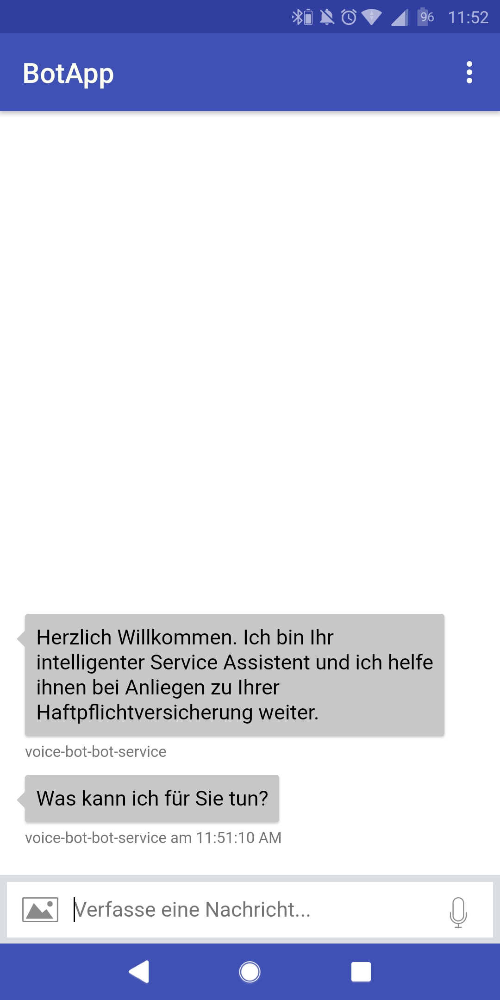
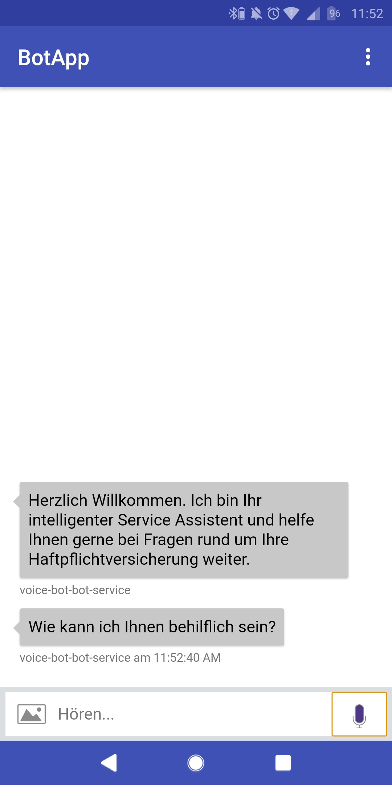

NOTE: If you want to use the application to test your Bot, then please change the URL in the app settings or change the default app in: app > main > res > xml > preferences.xml  

# About this project
This Android application can be used for demonstrating the Android app and web integration of a Microsoft Bot and has been created for presentation purposes. The application uses WebView and is written for the SDK version 26+ (Android 8.0+). Not only images can be send using the icon in the left bottom corner, but also the speech feature is fully usable (STT & TTS) via the button in the bottom right. The app requires permissions for the microphone to record audio and use the speech feature.

# Android App - Download and installation
Please clone the repository and build the app. The resulting apk file can be installed on your Android phone.

## APK file - explanation
An Android Package Kit (APK for short) is the package file format used by the Android operating system for distribution and installation of mobile apps. Just like Windows (PC) systems use an .exe file for installing software, the APK does the same for Android.

## Enabling APK Installations
1. Before you can install the APK on your phone you will need to make sure that third-party apps are allowed on your device.
2. Go to Menu > Settings > Security > and check Unknown Sources to allow your phone to install apps from sources other than the Google Play Store.
3. Android 8.0 Oreo does things a little differently. Rather than check a global setting to allow installation from unknown sources, you'll be you'll be prompted to allow your browser or file manager to install APKs the first time you attempt to do so.
4. If you like, you can also download a file manager app so you can easily find files on your Android device.
5. Once you've downloaded the APK file on your computer, connect your Android device to it.
6. At this point, you may be asked if you want to charge your phone or connect it as a 'media device.' Choose Media device.
7. Then, find your phone's folder on your computer. It will be in 'My Computer' or 'Computer' on Windows (PC).
8. Copy the APK file into a folder of your choice in your Android smartphone.
9. You will now be able to search for the file location in the My files folder of your device.
10. Find the APK file, tap it, then hit Install.

And now you're done, congratulations, you have your app. Just open it up from your smartphone and start a conversation with your bot.

# Screenshots

# Current status of the project
- Todo: fix the color issue (not all colors change and the colors in settings do not change)
